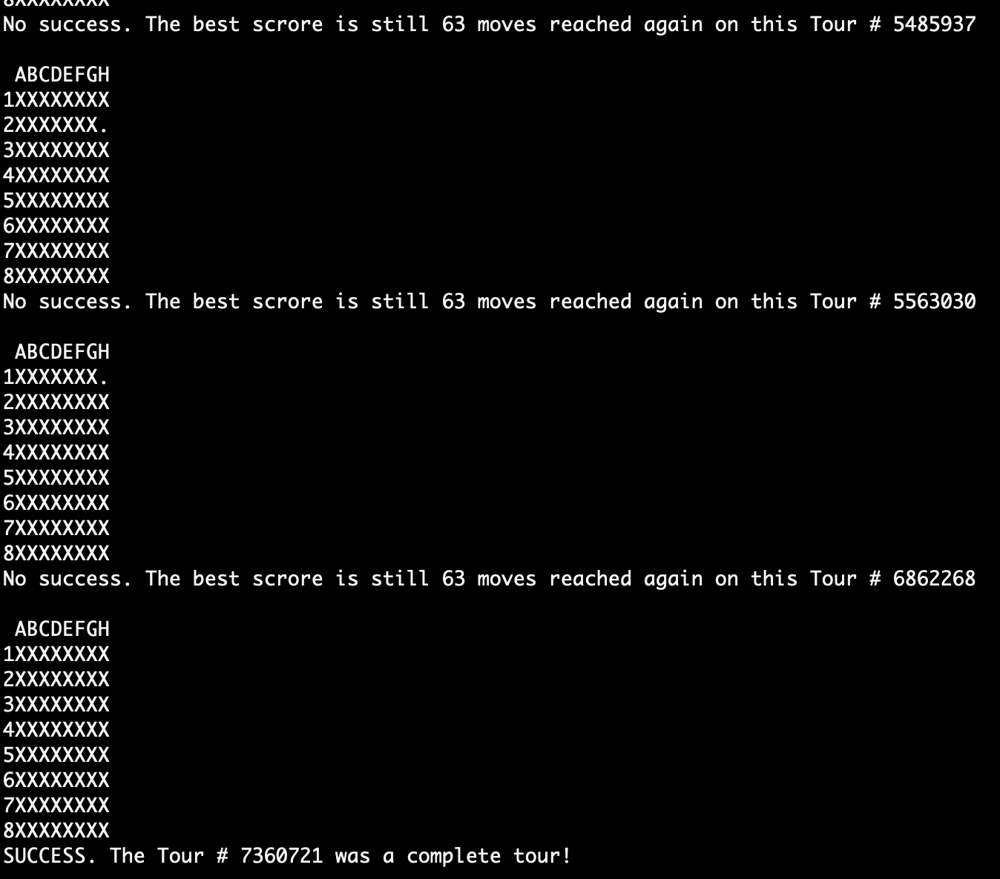
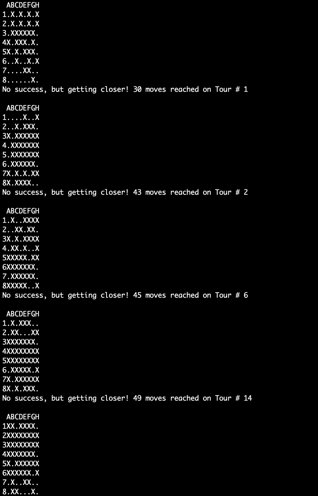
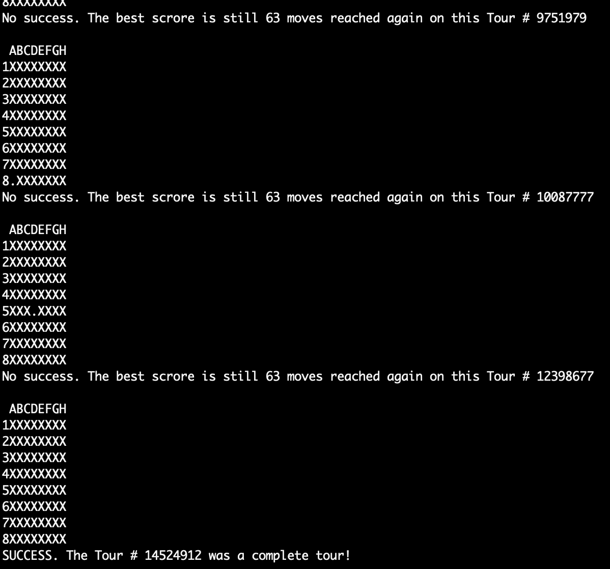

# Knight Tour

## Instructions
This is a chess game for the Console figuring out if the knight can make a full tour of the chessboard. The goal is to step on every square on the board but not mre than once on any square.

The game is brute force one 

## The strategy
1. The knight tour starts from a randomly selected square.
2. At the beginning, all square on the chessboard will be empty, except for the one square where the knight starts the tour.
3. As the knight moves, a character will mark each square the knight has stepped on.
4. If the knight can't do anymore moves, the tour ends
 - If all squares have a character on them, the knight completed the tour. Statistics is displayed.
 - If there are empty squares, the tour was incomplete, and we start a new tour.
 5. The program runs until a full tour is made
 6. It is displayed how many tours it took to finally finish a full tour.
 7. As the program progresses the best tours are displayed. When a tour is better than the previous one, or matches its best  tour moves, the chessboard and the statistics is displayed.

Open the program in Visual Studio and click play.

## Screenshots

Below are three screenshots,
- the first one showing the end result of the first run, thus it took 7.360.721 tries to finish.
- the second showing the start of the second run
- the third showing the end result of the second run, it took as many as 14.524.912 tries to finish.

## Built with
The project is built in Visual Studio, as a .NET Console Project, with C# as programming language

## Author
* Albert Stjärne (https://github.com/AlbertStjarne)
